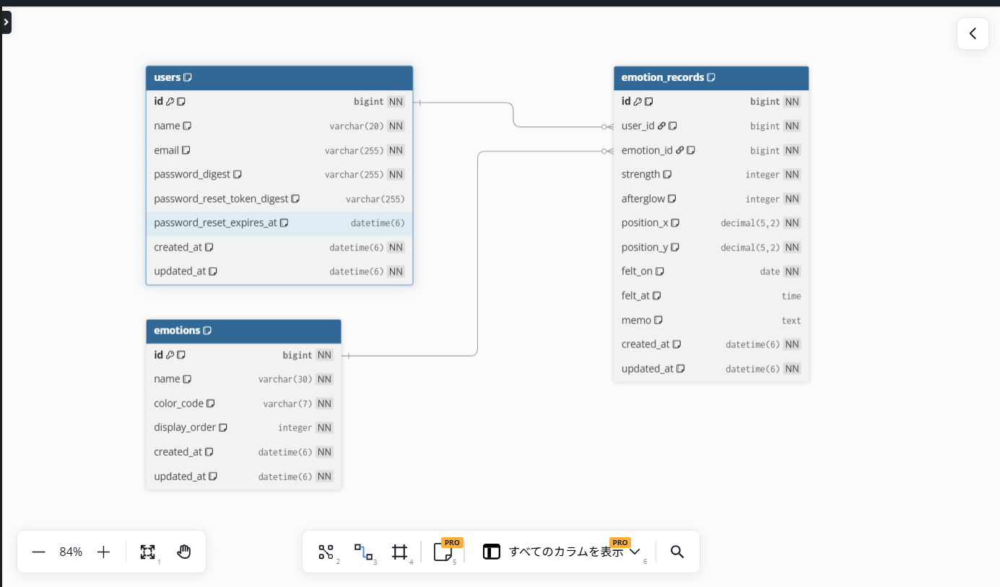

# Shikisai 〜感情の木〜

> 一日の感情を、一つの答えではなく、重なり合う色として残す。

**Production:** https://shikisai-emotion-tree-production.up.railway.app/

最終更新：2026-09-18

---

## 1. サービス概要

**Shikisai 〜感情の木〜**は、一日の中で感じた複数の感情を色として一本の木に重ね、自分の心の移り変わりを振り返る感情記録Webアプリです。

仕事や学習で一つの失敗を引きずり、その日全体まで悪く捉えてしまう人が、短時間の記録から「その日にはほかの感情もあった」と気づける状態を目指します。

感情を数値やグラフだけで分析するのではなく、感情の種類を色、強さを広がり、余韻を濃さとして木へ残し、一日を一つの景色として眺められる体験を提供します。

---

## 2. このアイデアはどこから生まれたか

### 2-1. きっかけとなった体験・感情

2026年6月から新しい職場で働きながら、Webエンジニアへの転職を目指してプログラミング学習を続けていました。

それ以前にも、仕事や学習で一つうまくできなかったことがあると、その場面を何度も思い返し、「今日は何もできなかった」「今日は悪い一日だった」と、一つの出来事から一日全体を評価してしまうことがありました。

しかし、同じ一日の中には、悔しさだけでなく、誰かと話して楽しかった気持ち、助けてもらって安心した気持ち、腹が立った気持ち、寂しかった気持ちなど、複数の感情が存在しています。

この経験から、一日を「良い日」「悪い日」のどちらかへ分類するのではなく、その日に存在した複数の感情を、複数の色として一つの画面に残せないかと考えました。

### 2-2. なぜそれが「気になった」のか

私は、一つの失敗を必要以上に重く受け止め、できなかったことへ意識が集中することで、その日にあったほかの出来事や感情を見落としやすいと感じています。

一方で、ネガティブな感情を消したり、無理に前向きな感情へ置き換えたりしたいわけではありません。悲しさ、不安、怒り、寂しさも、そのとき実際に感じた感情です。

大切にしたいのは、感情を「良い・悪い」で裁くことではなく、複数の感情が同じ一日の中に存在していたことを、そのまま振り返ることです。

そのため、感情を点数だけで管理するのではなく、色彩や自然の移ろいのように眺められるサービスを作りたいと考えました。

---

## 3. 課題の整理

### 3-1. 表に見えている困りごと

失敗や人からの指摘など、強く印象に残った一つの出来事を、その後も何度も思い返してしまうことです。

その感情を引きずることで、次の行動へ移りにくくなり、一日の中にあったほかの出来事や感情へ意識を向けにくくなります。

### 3-2. 本当に解決したい課題は何か

**なぜ、強い感情を引きずることが困るのか？**

一つの出来事を繰り返し思い返し、仕事、学習、休息など、次に行いたいことへ意識を切り替えにくくなるからです。

**なぜ、次の行動へ移れないことが困るのか？**

その後の時間にまで影響し、「今日も何もできなかった」という新たな自己否定につながるからです。

**なぜ、自己否定につながることが困るのか？**

実際には同じ一日の中に、楽しかったこと、安心したこと、できたことも存在しているにもかかわらず、それらを認識しにくくなるからです。

**なぜ、ほかの感情を認識できないことが困るのか？**

一つの感情だけを根拠に、その日全体や自分自身を一面的に評価する状態が繰り返されるからです。

### 本当に解決したい課題

**一つの強い感情だけで、その日全体や自分自身を一面的に捉え、その日に存在したほかの感情へ気づけなくなること。**

Shikisaiは、ネガティブな感情を消すことを目的としません。暗い感情も含めて複数の感情を残すことで、ユーザー自身が「暗いこともあったけれど、暗いだけの一日ではなかった」と気づける状態を目指します。

---

## 4. 想定ユーザーについて

### 4-1. 想定しているユーザー

#### 年齢設定

- **年齢：22歳**
- **理由：** 学校から仕事への移行、新しい職場への就職、転職に向けた学習など、生活環境が大きく変化しやすい年代だからです。まだ経験が少ない中で周囲と比較したり、一つの失敗を自分の能力全体の問題として受け止めたりしやすい人を想定しています。

#### 生活・状況設定

- **生活・状況：** 新しい職場でシフト勤務をしながら、帰宅後や休日にWebエンジニアへの転職を目指して学習している。仕事や学習で一つ失敗すると、その出来事を帰宅後も思い返し、予定していた学習や休息へ切り替えにくい。
- **理由：** 仕事と学習を両立しているため、毎日長い日記を書く時間や気力はありません。Shikisaiでは、用意された感情から一つを選び、強さ・余韻・位置を設定して保存する操作を繰り返すことで、一日の複数の感情を短時間で残せるようにします。

#### 環境設定

- **環境：** 新しい職場や学習環境に入り、まだ十分な自信を持てていない。人からの評価を気にしやすく、悩みを一人で抱え込みやすい。
- **理由：** 感情記録は公開せず、ログインした本人の記録だけを扱います。メモも任意とし、感情をうまく言葉にできないときでも色として残せるようにします。

### 4-2. 自分とユーザーの距離

最も近いものは、**自分自身**です。

このサービスが扱う課題は、私自身が感じてきたものです。仕事と学習を並行する生活の中で、どのような場面で感情を引きずるのか、どの程度の操作なら負担なく使えるのか、木の表現を見て一日の捉え方が変わるのかを、自分自身でも継続して検証できます。

ただし、自分だけに合うサービスになることを避けるため、同じような経験を持つ人へのヒアリングを行い、共通する課題と個人的な好みを分けて考えます。

### 4-3. 実際に使われる可能性について

#### 現時点で確認できていること

身近な1名にアプリの考え方を説明したところ、一つの感情だけで一日を捉えてしまう課題への共感があり、複数の感情をキャンバスのように重ねて表現する考え方についても興味を持ってもらえました。

ただし、1名からの意見だけでは需要があるとは判断できません。今後は、次の点を継続して確認します。

- 感情を引きずる人が実際にどの程度いるか
- その感情が行動や自己評価へどのような影響を与えるか
- 現在どのような方法で感情を整理しているか
- 一日に複数の感情を残す体験に価値を感じるか
- 短時間の記録を生活の中で続けられそうか
- 使わないとすれば、何が利用の障壁になるか

#### 最初に使ってくれそうな人

最初のユーザーは開発者自身です。

その次に、新しい職場や学習環境に入り、失敗や人からの指摘を帰宅後まで引きずりやすい20代前半の知人を想定しています。

#### アプリを思い出す場面

- 仕事や学習で失敗した直後
- 人から注意や指摘を受けたとき
- 自分と周囲を比較して落ち込んだとき
- 帰宅後も同じ出来事を思い返しているとき
- 就寝前に一日を振り返るとき
- 日記を書くほどの気力はないが、感情を残しておきたいとき

#### 現在、代わりに使っているもの

- 紙の日記やスマートフォンのメモ
- 家族や友人への相談
- ChatGPTなどの対話型AI
- SNSへの投稿
- 音楽、散歩、睡眠などによる気分転換
- 特に何もせず、時間が過ぎるのを待つ

#### 置き換えてまで使う理由

Shikisaiは、日記や人への相談を完全に置き換えるものではありません。

文章を書く余裕がないときや、人へ相談する前の段階で、複数の感情を短時間で整理する補助的な手段として使われることを想定しています。

1. まずShikisaiで、その日にあった感情を一つずつ色として残す
2. さらに整理したい場合は、日記を書く
3. 一人で抱えることが難しい場合は、家族、友人、専門家などへ相談する

既存の方法と併用できることが、実際の生活へ取り入れやすい理由になると考えています。

### 4-4. ユーザーがサービスを導入して利用するまでのイメージ

#### 1. サービスを知る

仕事や学習での失敗を引きずっているときに、開発記録や知人からの紹介を通じてShikisaiを知ります。

「感情を前向きに変えるアプリ」ではなく、「暗い感情も含め、その日にあった複数の感情を残すアプリ」という説明に、自分の経験との共通点を感じます。

#### 2. 最初の感情を記録する

1. ユーザー登録後、ログインする
2. 固定8感情から、そのとき残したい感情を一つ選ぶ
3. 強さ・余韻を0〜100で調整する
4. 木の樹冠内で感情を置きたい位置を選ぶ
5. 必要な場合だけ短いメモを入力する
6. 確認画面で内容を確認し、必要に応じて感じた時刻を入力する
7. 感情記録を保存する

同じ日に別の感情を残したい場合は、同じ操作を繰り返します。保存した複数の感情は、その日の一本の木へ重ねて表示されます。

#### 3. 一日の終わりに振り返る

「木を見る」画面で、その日に保存した複数の感情が重なった木を確認します。前日・翌日の切り替えや、カレンダーからの日付選択によって過去日の木も振り返れます。

#### 4. 利用を続ける

毎日の連続記録を競うのではなく、感情が大きく動いた日や振り返りたい日に記録します。

日ごとの木が蓄積することで、過去の自分がどのような感情を抱いていたかを、文章だけでなく色彩として見返せることを継続理由とします。

---

## 5. 既存サービス・競合調査

### 5-1. 似たサービスの調査

#### Daylio

- **サービス名：** Daylio
- **URL：** https://daylio.net/
- **できること：**
  - 気分と、その日に行った活動を短い操作で記録できる
  - 必要に応じて文章、写真、音声などを追加できる
  - 記録をカレンダーや一覧で見返せる
  - 蓄積した気分と行動を、統計、グラフ、相関関係として確認できる
  - 気分や活動の項目をカスタマイズできる

#### How We Feel

- **サービス名：** How We Feel
- **URL：** https://howwefeel.org/
- **できること：**
  - 現在の状態に近い感情語を選び、感情を記録できる
  - 継続した記録から、自分の感情の傾向を確認できる
  - 感情へ対処するための短い方法や動画を確認できる
  - 信頼する相手と感情を共有できる

### 5-2. それでも自分が作りたい理由

Daylioには短時間で記録できる仕組みや詳細な統計があり、How We Feelには多様な感情語から自分の状態を選ぶ仕組みがあります。そのため、「感情を短時間で記録する」「感情を色で表す」だけでは、Shikisai独自の価値にはなりません。

私が既存サービスに感じたズレは、記録した感情が主に統計、グラフ、傾向分析、対処方法として提示されることです。

Shikisaiで作りたいのは、感情を分析して正解へ導く体験ではありません。暗い色を明るい色へ塗り替えるのではなく、暗い色も明るい色も一本の木の中に残し、その日の感情全体を一つの景色として眺める体験です。

### 5-3. 差別化を「体験価値」で表現する

このアプリは、**新しい職場や学習環境での一つの失敗を帰宅後まで引きずってしまう22歳の人が、就寝前などの短い時間で、その日に存在した複数の感情を振り返る瞬間**を最も助けるアプリです。

#### 私のアプリの差別化ポイント

**一日の気分を一つ選んで分析するのではなく、一日の中にあった複数の感情を一本の木へ色として重ね、その日の感情全体を一つの景色として眺められること。**

> 「今日は悪い一日だった」と記録して終わるのではなく、  
> 「暗いこともあったけれど、暗いだけの一日ではなかった」と、  
> 自分自身で気づける。

---

## 6. このサービスで提供したい価値

### 6-1. ユーザーの変化

#### 行動の変化

- 強い感情を抱えたまま一日を終える前に、短い時間だけ振り返るようになる
- 長い文章を書けない日でも、感情・強さ・余韻・位置を中心に記録できる
- 最も強かった感情以外に、その日に何を感じていたかを思い出すようになる
- 必要に応じて、日記を書く、人へ相談するなど、次の行動を選びやすくなる

#### 気持ちの変化

- ネガティブな感情を無理に消さなくてもよいと思える
- 「今日は最悪だった」という一面的な判断から少し距離を取れる
- 小さな安心、喜び、感謝なども同じ日に存在していたと気づける
- 感情をうまく言葉にできなくても、色として残せる安心感を得られる

#### 考え方の変化

- 一日を「良い・悪い」の二択だけで評価しなくなる
- 感情は一つではなく、同じ一日の中に複数存在すると捉えられる
- 暗い感情も自分の一部として、否定せずに振り返れる
- 自分の心の状態を、固定された評価ではなく、移り変わるものとして見られる

### 6-2. 価値を一文で表す

**このサービスは、一つの失敗や強い感情で一日全体を否定してしまう人が、その日に存在した複数の感情を色として眺め、自分の一日を多面的に振り返れるようになるサービスです。**

---

## 7. このアプリで実現すること

MVPでは、**「感情を記録 → 木へ反映 → 日別・カレンダーで振り返る」**という、Shikisaiの中心体験が成立する範囲を優先して実装しました。

### 7-1. MVPで実装した機能

#### ユーザー管理

- ユーザー登録
- ログイン・ログアウト
- `/tree`、`/emotion_records/new`、`/calendar`、`/mypage` のログイン必須制御
- `current_user` を基準に、自分の感情記録だけを作成・閲覧する制御

#### 感情記録

- 固定8感情から1種類を選択
- 感情の強さを0〜100で設定
- 感情の余韻を0〜100で設定
- 木の樹冠内で感情の位置を選択
- 短いメモを任意入力
- 感じた時刻を任意入力
- 保存前のプレビュー・登録内容確認
- 1件の `EmotionRecord` に1種類の感情を保存
- 同じ日に複数件の感情記録を保存

#### 感情の木

- 感情の種類を色として表示
- `strength` を色の広がりへ反映
- `afterglow` を色の濃さ・透明度へ反映
- `position_x` / `position_y` を木上の位置へ反映
- 同じ日の複数の感情記録を一本の木へ重ねて表示
- 保存済み `EmotionRecord` から日ごとの木を再構成
- 今日の記録が0件の場合は基礎木と「今日を彩る」導線を表示

#### 振り返り・カレンダー

- 今日・過去日の木を閲覧
- 前日・翌日による日付切り替え
- 未来日への移動を制限
- 月単位のカレンダー表示
- 前月・次月による月切り替え
- 未来月・未来日への操作を制限
- 各日の代表感情を最大3色で表示
- カレンダーの日付から対象日の木へ遷移

#### マイページ・法的情報

- MVP向けマイページ
- 利用規約
- プライバシーポリシー
- ログアウト確認モーダル
- 主要4画面を共通ボトムナビで接続

### 7-2. 当初MVPで予定していたが見送った機能

MVPでは中心体験の完成を優先したため、アカウント管理や保存済み記録のCRUDはPost-MVPへ移しました。

- パスワード再設定・新しいパスワード設定
- ユーザー名変更
- メールアドレス変更
- ログイン中のパスワード変更
- アカウント退会
- 保存済み感情の詳細表示・感情詳細モーダル
- 保存済み感情の編集
- 保存済み感情の削除
- アカウント管理を含むマイページ拡張

### 7-3. MVP後の発展候補

以下は、Shikisaiの中心体験をさらに深める将来構想です。

#### 1. 月間リプレイ機能

1か月分の日ごとの感情の木を、月初から月末まで時系列で再生します。数値の増減を示す分析画面ではなく、木の色がどのように重なり、移ろってきたかを一つの作品として振り返る機能を想定しています。

#### 2. 演出強化

- 色が木へゆっくり広がるアニメーション
- 複数の色が水彩のように重なる表現
- 月間リプレイで、木の色彩が四季のように移ろう演出
- 画面表示や記録保存時の、静かで落ち着いた動き

演出は派手さを目的とせず、ユーザーが自分の感情を急いで評価せず、少し立ち止まって眺められる時間を作るために使用します。

#### 3. 感情を任意で追加できる機能

MVPでは固定8感情から選択します。MVP後は、ユーザーが自分の感覚に合う感情名と色を追加できる機能を検討します。

---

## 8. このアプリの懸念点とその対策

### 懸念点①：世界観は評価されても、実際には使われない可能性

- **何が問題になりそうか：** 木や色彩の表現を「きれい」「面白い」と感じてもらえても、日常の中で継続して開く理由にならない可能性があります。
- **なぜそう思うか：** 見た目への好意と、実際に自分の感情を記録する行動は別だからです。
- **そのために考えている対策：**
  - ヒアリングでは「素敵だと思うか」だけでなく、「どの場面で使うか」「使わない理由は何か」を確認する
  - MVP公開後は、初回記録の完了や再訪など、実際の利用状況を確認する
  - 演出より先に、複数の感情を短時間で残せる中心フローを完成させる

### 懸念点②：記録そのものが負担になる可能性

- **何が問題になりそうか：** 感情を振り返る余裕がない日に入力が面倒になり、使われなくなる可能性があります。
- **なぜそう思うか：** 感情を引きずっているときほど、長い文章を書いたり、細かく設定したりする気力が少ないためです。
- **そのために考えている対策：**
  - メモと感じた時刻は任意にする
  - 感情・強さ・余韻・位置を中心に記録できるようにする
  - 毎日の連続記録を求めない
  - 記録しなかった日を失敗として扱う演出を入れない

### 懸念点③：視覚表現の実装へ時間をかけすぎる可能性

- **何が問題になりそうか：** 水彩、四季、アニメーションへ最初からこだわると、基本機能が完成しない可能性があります。
- **なぜそう思うか：** Shikisaiの魅力は視覚表現にありますが、描画方法の調査や調整には時間がかかるためです。
- **そのために考えている対策：**
  - MVPではPNGの基礎木とCSSによる感情色の重なりを中心とした表現に絞る
  - 樹冠への描画制限と位置選択は、PNG maskとSVG hit areaで責務を分ける
  - 月間リプレイとアニメーション強化はMVP後に分ける
  - 見た目だけでなく、記録から再表示まで一連の動作が成立する機能を優先する

### 懸念点④：感情記録のプライバシー

- **何が問題になりそうか：** 感情やメモには、本人にとって私的な情報が含まれる可能性があります。
- **なぜそう思うか：** 記録が他人に閲覧された場合、一般的な投稿サービスより心理的な負担が大きいと考えられるためです。
- **そのために考えている対策：**
  - 公開タイムラインやランキングを作らない
  - ログイン必須画面を設け、`current_user` を基準に本人の記録だけを扱う
  - 必要以上の個人情報を収集しない
  - 保存済み記録の削除やアカウント退会はPost-MVPで再検討する

> Shikisaiは、医療行為、診断、心理療法を目的とするサービスではありません。専門的な心理支援が必要な場合に、それらの代替となることを目的としていません。

---

## 9. 今後の展開・発展の方向性

### ユーザーが使い続ける理由

一回の記録では、その日にあった一つの感情を木へ残せます。同じ日に記録を重ねることで、その日に存在した複数の感情を一本の木として振り返れます。

記録を続けると日ごとの木が蓄積し、過去日の木やカレンダーから、自分の感情を色彩として見返せます。継続日数や達成数を競うのではなく、自分だけの色彩が時間とともに残っていくことを利用継続の価値とします。

### 続けることで変わること

- 一つの強い感情だけで一日を判断する回数が減る
- 同じ一日の中に複数の感情があったことを思い出しやすくなる
- 過去の自分の感情を、良い・悪いの評価ではなく、移り変わりとして見返せる
- MVP後に感情の任意追加を実装した場合、より自分の感覚に近い記録ができる

### データが溜まるとできること

MVPでは、日ごとの木とカレンダーから過去の感情を振り返れます。

MVP後は、蓄積した日ごとの感情の木を月間リプレイとして日付順に再生し、木の色がどのように重なり、移ろってきたかを鑑賞する機能を検討します。

### 他の人と関わる余地

感情記録は私的な情報であるため、他人との交流や共有を中心機能にはしません。

現時点では、SNS機能、ランキング、他人との比較機能は実装予定に含めず、自分自身の振り返りに集中できる設計とします。

### 今考えている発展案

| 分類 | 発展案 | 目的 |
| --- | --- | --- |
| 機能追加 | 月間リプレイ | 一か月の感情の移り変わりを、日付順の木の変化として振り返る |
| 機能追加 | 感情の任意追加 | 既存の選択肢にない感情を、自分の言葉と色で残す |
| UI・体験改善 | 演出強化 | 水彩の重なりや四季の移ろいを通して、感情を急いで評価せず眺める時間を作る |
| 機能以外の工夫 | 継続的なユーザーヒアリング | 利用場面、利用障壁、使わない理由を確認する |
| 機能以外の工夫 | 表現と言葉の見直し | 感情を良い・悪いと決めつけず、医療効果を誤認させない案内へ整える |

将来機能を無制限に増やさず、中心体験を深める機能から優先順位を再検討して着手します。

---

## 10. 技術スタック

### 10-1. 使用技術

| 分類 | 使用技術 | 用途 |
| --- | --- | --- |
| 言語 | Ruby 3.4.10 | Railsアプリケーションの実装 |
| フレームワーク | Ruby on Rails 8.1.3.1 | ユーザー管理、感情記録、日付別データの保存・表示 |
| フロントエンド | Rails View / Turbo | サーバーサイドレンダリングと画面遷移 |
| JavaScript | Stimulus / Importmap | 感情入力、プレビュー、確認モーダル、ログアウト確認など |
| Asset管理 | Propshaft | CSS・画像等のAsset配信 |
| 描画 | PNG / CSS / SVG | 基礎木、感情色の重なり、mask、樹冠hit area |
| CSS | 独自CSS | レスポンシブ対応と画面スタイリング |
| DB | MySQL / mysql2 | ユーザー・感情マスター・感情記録の保存 |
| 認証 | `has_secure_password` / bcrypt | パスワード認証とSessionを用いたログイン |
| テスト | RSpec / FactoryBot | Model・Request等の自動テスト |
| CI | GitHub Actions | push / Pull Request時のCI実行 |
| デプロイ | Railway | Production環境の公開 |
| デザイン | Figma | 画面設計、操作フロー、木の表現の検討 |
| バージョン管理 | Git / GitHub | Issue、Pull Request、ソースコード管理 |

### 10-2. 技術選定の比較検討

| 候補 | 採用／不採用 | 理由 |
| --- | --- | --- |
| Ruby on Rails | 採用 | RUNTEQで学習している技術を活用し、認証・DB処理・画面表示を一つの構成で実装できるため |
| Rails View / Hotwire | 採用 | MVPに必要な動的操作を実装しながら、フロントエンドとバックエンドを分離しすぎず完成を優先できるため |
| React | MVPでは不採用 | MVPの中心体験にはStimulusで対応でき、API設計とReactの追加学習を同時に抱えないため |
| Next.js | 不採用 | MVPでは独立したフロントエンド構成やSSRを必要としていないため |
| PNG / CSS / SVG | 採用 | 基礎木・感情色・mask・hit areaを役割ごとに分け、Stimulusから操作しやすくするため |
| Canvas | MVPでは不採用 | 水彩表現には適する可能性がある一方、MVPでは現在の描画方式で中心体験を成立させられるため |
| MySQL | 採用 | 開発・テスト・Productionで利用するRDBとして採用したため |
| PostgreSQL | 不採用 | 当初候補から変更し、現在の実装ではMySQLへ統一したため |
| `has_secure_password` / bcrypt | 採用 | MVPに必要な登録・ログインをRails標準寄りの小さな構成で実装するため |
| Sorcery | 不採用 | MVPでは`has_secure_password`とSession管理で必要な認証範囲を満たせるため |
| 独自CSS | 採用 | 現在の画面デザインとレスポンシブ対応を、追加CSSフレームワークなしで実装するため |
| Tailwind CSS | 不採用 | 現在のMVPでは独自CSSを採用したため |
| Railway | 採用 | ProductionのWebアプリとDBを公開するため |
| Render | 不採用 | 当初候補から変更し、ProductionはRailwayへ統一したため |

### 今回チャレンジした点

- 1件の感情記録と、日ごとに複数存在する感情を関連づけるデータ設計
- 感情の強さを色の広がり、余韻を濃さへ変換する処理
- PNG / CSS / SVGとStimulusを組み合わせたリアルタイムプレビュー
- 樹冠だけを選択可能にするSVG hit area
- 数値や折れ線グラフに依存しない振り返り画面
- `current_user` を基準に本人の感情記録だけを扱う認証・データ取得
- 日ごとの `EmotionRecord` から同じ木の状態を再構成できる設計

### 不安な点

- 複数の色を重ねたときに、感情の違いが分かりにくくならないか
- 木の表現へこだわりすぎて、基本機能の開発が遅れないか
- 短時間で記録できる操作量に抑えられているか
- 月間リプレイで必要になるデータを、現在のデータからどこまで再利用できるか
- 現在の描画方式で、Shikisaiの世界観をどこまで表現できるか
- 実際のユーザーが、見た目だけでなく振り返りの価値を感じるか

### 10-3. キャッチアップ不足の懸念

Shikisaiで技術的な不確実性が高かった部分は、複数の感情を一本の木へ重ねる描画と、保存した記録から同じ表示を再構成する処理でした。

ReactやCanvasをMVPから導入すると学習範囲が広がるため、MVPではRails View・Stimulus・CSSを中心に、必要な箇所だけPNGとSVGを組み合わせました。

実装は、基礎木の表示、感情色の仮配置、強さ・余韻の反映、複数色の重ね合わせ、保存・再表示、過去日表示の順に段階的に進めました。月間リプレイや高度な演出が必要になった段階で、Canvasやほかの描画方式を改めて技術検証します。

### 画面遷移図

[画面遷移図（Figma）](https://www.figma.com/design/XOu0IkJpTVf1uMBY7StPPY/Shikisai-~%E6%84%9F%E6%83%85%E3%81%AE%E6%9C%A8~-%E7%94%BB%E9%9D%A2%E9%81%B7%E7%A7%BB%E5%9B%B3?node-id=2-5&t=3cbIeyRFNEv8o2yx-0)

### 本サービスの概要（700文字以内）

Shikisai 〜感情の木〜は、一日の中で感じた複数の感情を、数値やグラフだけでなく、一本の木に重なる色の広がりや濃淡として記録・閲覧できる感情記録Webアプリです。

強く印象に残った出来事があると、その感情だけで「今日はつらい一日だった」と一日全体を捉えてしまうことがあります。本サービスでは、その日に感じた感情を一つずつ記録し、同じ日の複数の感情を一本の木へ重ねることで、複数の感情が共存していた一日を俯瞰できる体験を提供します。

「今日を彩る」では、固定8感情から一つを選び、強さを色の広がり、余韻を濃さ・透明度として調整し、木の樹冠内へ配置します。メモと感じた時刻は任意です。「木を見る」では今日・過去日の記録を振り返り、「カレンダー」では各日の代表感情を最大3色で確認できます。

感情を良い・悪いで評価したり、無理に前向きへ変えたりするのではなく、その日の感情全体を一つの景色として受け止めやすくすることを目指します。

### READMEに記載した機能（MVP時点）

#### MVPで実装した機能

- [x] ユーザー登録
- [x] ログイン
- [x] ログアウト
- [x] ログイン必須画面のアクセス制御
- [x] 感情の種類を選択
- [x] 感情の強さを色の広がりで表現
- [x] 感情の余韻を色の濃さ・透明度で表現
- [x] 任意のメモを記録
- [x] 感情を感じた時刻を任意で設定
- [x] 木の樹冠内に感情を配置
- [x] 感情を一件ずつ確認・保存
- [x] 同日に複数の感情を記録
- [x] 今日・過去日の日ごとの木を閲覧
- [x] カレンダーから過去日の木を閲覧
- [x] 利用規約の表示
- [x] プライバシーポリシーの表示
- [x] MVP向けマイページ

#### 当初MVP予定からPost-MVPへ移した機能

- [ ] パスワード再設定
- [ ] 保存済み感情の詳細表示
- [ ] 保存済み感情の編集
- [ ] 保存済み感情の削除
- [ ] ユーザー名・メールアドレスの変更
- [ ] ログイン中のパスワード変更
- [ ] アカウント退会

### 未ログインでも閲覧または利用できるページ

- [x] トップページ
- [x] 新規登録画面
- [x] ログイン画面
- [x] 利用規約ページ
- [x] プライバシーポリシーページ
- [ ] パスワード再設定メール送信画面（Post-MVP）
- [ ] 新しいパスワード設定画面（Post-MVP）

### ユーザー情報の変更項目（Post-MVP）

MVPではユーザー情報変更機能を提供していません。以下はPost-MVPで再検討します。

- [ ] ユーザー名
- [ ] メールアドレス
- [ ] パスワード
  - [ ] 現在のパスワード
  - [ ] 新しいパスワード
  - [ ] 新しいパスワード（確認）

### ER図

[ER図仕様書](Shikisai_ER図・データベース設計仕様書_最終版.md)

[dbdiagram.io用DBMLシート](Shikisai_dbdiagram.io用_DBMLシート_最終版.md)

### 本サービスの概要（MVP完成時点）

Shikisai 〜感情の木〜は、一日の中で感じた複数の感情を、色として一本の木に残す感情記録Webアプリです。

ユーザーは固定8感情から一つを選び、強さを色の広がり、余韻を色の濃さ・透明度として調整し、木の樹冠内へ配置します。任意で感じた時刻やメモも残せます。同じ日に複数の感情を一件ずつ保存でき、保存した記録は日ごとの木へ重ねて再描画されます。

「木を見る」では今日・過去日の木を確認でき、「カレンダー」では各日の主な感情を最大3色で確認し、対象日の木へ移動できます。

保存済み感情の詳細・編集・削除、パスワード再設定、アカウント情報変更、退会はMVPでは実装せず、中心体験の完成を優先してPost-MVPへ移しています。

### MVPで実装した機能

- ユーザーの新規登録
- ログイン・ログアウト
- ログイン必須画面のアクセス制御
- 固定8感情からの感情選択
- 感情の強さ・余韻の設定
- 木の樹冠内への感情配置
- 感じた時刻の任意入力
- メモの任意入力
- 保存前プレビュー・登録内容確認
- 感情記録の新規作成・保存
- 同日への複数感情記録
- 今日・過去日の感情の木の閲覧
- 日付切り替え
- カレンダーでの日別感情の振り返り
- カレンダーから過去日の木への遷移
- 利用規約の表示
- プライバシーポリシーの表示
- MVP向けマイページ

### 当初MVPで予定していたが見送った機能

- パスワード再設定・新しいパスワード設定
- ユーザー名・メールアドレス変更
- ログイン中のパスワード変更
- アカウント退会
- 保存済み感情の詳細表示
- 保存済み感情の編集
- 保存済み感情の削除
- アカウント管理を含むマイページ拡張

MVPでは「感情を記録 → 木へ反映 → 日別・カレンダーで振り返る」という中心体験の完成を優先し、上記はPost-MVPへ移しました。

### テーブル詳細

#### usersテーブル

ユーザーのアカウント情報・認証情報を保存するテーブルです。パスワード再設定用カラムも存在しますが、パスワード再設定機能自体はMVPでは提供していません。

- `id` : `BIGINT` / ユーザーを一意に識別する主キー
- `name` : `VARCHAR(20)` / ユーザーの表示名
- `email` : `VARCHAR(255)` / ログイン用メールアドレス。小文字へ正規化して保存し、重複を禁止する
- `password_digest` : `VARCHAR(255)` / bcryptでハッシュ化したパスワードダイジェスト。平文パスワードは保存しない
- `password_reset_token_digest` : `VARCHAR(255)` / パスワード再設定用トークンのダイジェスト。未発行時は`NULL`、重複を禁止する
- `password_reset_expires_at` : `DATETIME(6)` / パスワード再設定URLの有効期限用。未発行時は`NULL`
- `created_at` : `DATETIME(6)` / ユーザーの作成日時
- `updated_at` : `DATETIME(6)` / ユーザー情報の更新日時

#### emotionsテーブル

MVPで使用する感情の種類・表示色・表示順を一元管理する固定マスターテーブルです。

- `id` : `BIGINT` / 感情の種類を一意に識別する主キー
- `name` : `VARCHAR(30)` / 感情を識別する英語コード。小文字英字とアンダースコアを使用し、重複を禁止する
- `color_code` : `VARCHAR(7)` / 感情に対応する色を`#`と6桁の16進数で保存する
- `display_order` : `INTEGER` / 感情の表示順。1以上とし、重複を禁止する
- `created_at` : `DATETIME(6)` / 感情マスターの作成日時
- `updated_at` : `DATETIME(6)` / 感情マスターの更新日時

感情の日本語表示名はデータベースへ保存せず、RailsのI18nで管理します。

#### emotion_recordsテーブル

一人のユーザーが感じた、一種類の感情についての一件の記録を保存するテーブルです。同じユーザーが同じ日に複数件の感情記録を持てます。

- `id` : `BIGINT` / 感情記録を一意に識別する主キー
- `user_id` : `BIGINT` / 記録を所有するユーザーを示す外部キー。`users.id`を参照する
- `emotion_id` : `BIGINT` / 記録した感情の種類を示す外部キー。`emotions.id`を参照する
- `strength` : `INTEGER` / 感情の強さ。色の広がりとして使用し、0〜100で保存する
- `afterglow` : `INTEGER` / 感情の余韻。色の濃さ・透明度として使用し、0〜100で保存する
- `position_x` : `DECIMAL(5,2)` / 木の表示領域におけるX座標。0.00〜100.00%で保存する
- `position_y` : `DECIMAL(5,2)` / 木の表示領域におけるY座標。0.00〜100.00%で保存する
- `felt_on` : `DATE` / ユーザーが感情を感じた日付
- `felt_at` : `TIME` / ユーザーが感情を感じた時刻。未設定の場合は`NULL`
- `memo` : `TEXT` / 感情についての任意メモ。Rails側で最大200文字に制限する
- `created_at` : `DATETIME(6)` / 感情記録をデータベースへ登録した日時
- `updated_at` : `DATETIME(6)` / 感情記録の最終更新日時

### テーブル間のリレーション

- 一人のユーザーは、0件以上の感情記録を持つ
- 一件の感情記録は、必ず一人のユーザーに属する
- 一種類の感情は、0件以上の感情記録から参照される
- 一件の感情記録は、必ず一種類の感情に属する
- ユーザーを削除した場合、そのユーザーの感情記録も削除されるDB設計
- 感情記録から参照されている感情マスターは削除できない

### emotionsテーブルを独立させた理由

感情名を感情記録のたびに文字列として重複保存せず、感情の種類・色・表示順を一か所で統一管理するためです。

`emotion_records`では`emotion_id`を通じて`emotions`の定義を参照し、強さ・余韻・座標・日時など、記録ごとに変化する情報だけを保存します。これにより、感情名の表記揺れや存在しない感情の登録を防ぎ、データの整合性を保ちます。

### ER図の注意点

- [x] 最新のER図スクリーンショットがREADMEに掲載されているか
- [x] テーブル名は複数形になっているか
- [x] カラムの型は記載されているか
- [x] 主キーと外部キーは適切に設定されているか
- [x] `users`と`emotion_records`の1対多が正しく描かれているか
- [x] `emotions`と`emotion_records`の1対多が正しく描かれているか
- [x] 不要な多対多の関係になっていないか
- [x] STI用の`type`カラムを使用していないか
- [x] `users`テーブルに`user_name`のような不要な接頭辞を付けていないか
- [x] `emotion_records`に`user_id`と`emotion_id`が存在するか
- [x] 同じユーザーが同じ日に複数の感情を記録できる設計になっているか
- [x] `felt_on`が`DATE`、`felt_at`が`TIME`になっているか
- [x] ER図とREADMEで、カラム名・型・リレーションが一致しているか

### Webアプリの概要

Shikisai 〜感情の木〜は、一日の中で感じた複数の感情を、一本の木に重なる色として記録・振り返るWebアプリです。

仕事や学習で一つの失敗や強い感情を引きずり、「今日は悪い一日だった」と一日全体を捉えてしまいやすい人を主な対象にしています。

感情の種類・強さ・余韻・位置を一件ずつ記録し、日ごとの木やカレンダーから振り返ることで、悲しさや不安だけでなく、その日にあった安心や楽しさなど、複数の感情が共存していたことに気づける体験を目指します。

感情を良い・悪いで評価したり、無理に前向きに変えたりするのではなく、その日の感情全体を一つの景色として受け止めやすくすることが目的です。

### 1週間辺りの開発に向けられる時間

- 1週間あたり：約25時間

### ProjectsのURL

https://github.com/users/Rick723/projects/1/views/1?visibleFields=%5B%22Title%22%2C%22Status%22%2C403519325%2C403520758%5D

### MVPリリースまで

- ユーザー新規登録
- ログイン
- ログアウト
- ログイン必須画面のアクセス制御
- 感情の種類の選択
- 感情の強さの設定
- 感情の余韻の設定
- 木の樹冠内への感情の配置
- 感じた時刻の任意入力
- メモの任意入力
- 感情記録の新規作成・保存
- 同日への複数感情記録
- 今日の感情の木の閲覧
- 日付切替による過去日の感情の木の閲覧
- カレンダーでの日別感情の振り返り
- カレンダーから過去日の木への遷移
- 利用規約の表示
- プライバシーポリシーの表示
- MVP向けマイページ

### MVP後

#### 当初MVP予定から移した機能

- パスワード再設定・新しいパスワード設定
- ユーザー名・メールアドレス等のアカウント情報変更
- ログイン中のパスワード変更
- アカウント退会
- 保存済み感情の詳細表示
- 保存済み感情の編集
- 保存済み感情の削除
- マイページ・アカウント管理導線の再設計

#### 将来構想

- 1か月分の感情の変化を振り返る月間リプレイ
- 木や感情色のアニメーション・表現の強化
- ユーザーが任意の感情を追加できる機能

MVP後の機能については、MVP完成後の実装状況やユーザーフィードバックを確認し、優先順位・ISSUEの粒度・仕様を再検討してから着手します。

### MVPレビュー依頼予定日

予定日：2026年9月27日
