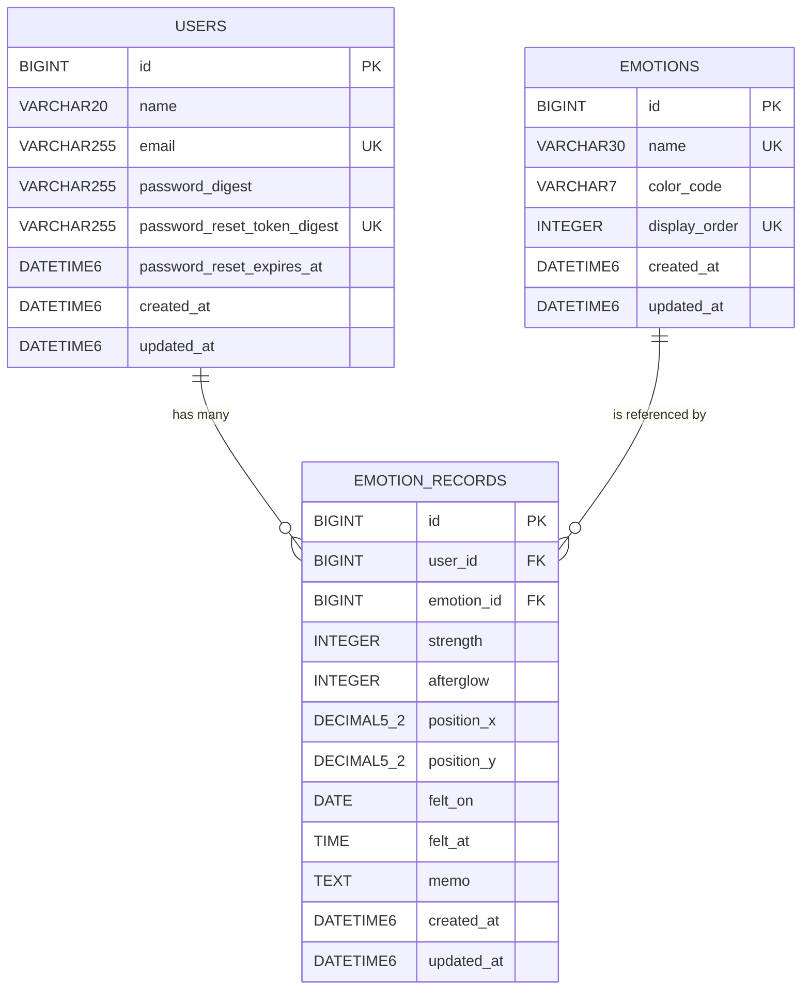

# Shikisai 〜感情の木〜 ER図・データベース設計仕様書 最終版

- 作成日：2026-08-11 JST
- 対象：Shikisai 〜感情の木〜 MVP
- ステータス：最終版
- 技術前提：Rails 7.2 / MySQL 8.4.11 / InnoDB / `mysql2`

---

## 1. 資料概要・目的・対象範囲

本資料は、感情記録Webアプリ「Shikisai 〜感情の木〜」MVPで永続化するデータと、その関係・制約・削除規則を実装時にそのまま参照できる形へ整理した最終版のER・データベース設計仕様書である。

対象はMVPの主要データであり、主要テーブルは次の3つに限定する。

1. `users`
2. `emotions`
3. `emotion_records`

旧資料に含まれていた2テーブル構成、`emotion_type`直接保存方式、PostgreSQL、強さ・余韻1〜5、座標0〜1などは本仕様では採用しない。

---

## 2. アプリ概要とDB設計方針

Shikisaiは、一日の中で感じた複数の感情を色として一本の木に残す感情記録アプリである。

DBでは、画面そのものではなく「後から再現・検索・更新するために保存が必要な事実」を永続化する。

- 感情の種類：`emotions`
- 感情の強さ：`emotion_records.strength`
- 感情の余韻：`emotion_records.afterglow`
- 木の葉領域内の位置：`position_x` / `position_y`
- 感じた日付：`felt_on`
- 感じた時間：`felt_at`
- 任意メモ：`memo`

日付・カレンダー・木は独立した保存対象ではなく、`emotion_records`を日付単位で検索・集計・描画して表現する。

### 用語

- **主キー（PK）**：各行を一意に識別するキー。
- **外部キー（FK）**：別テーブルの主キーを参照し、テーブル間の関係を保証するキー。
- **インデックス**：検索条件に使うカラムを効率よく探すための索引。
- **UNIQUE制約**：同じ値の重複を禁止する制約。
- **CHECK制約**：値が指定範囲・条件を満たすことをDB側で保証する制約。
- **多重度**：1件のデータに対して、相手側のデータを何件関連付けられるかを示す。

---

## 3. 採用技術とDB前提

| 項目 | 採用内容 |
|---|---|
| Webフレームワーク | Rails 7.2 |
| DBMS | MySQL 8.4.11 |
| ストレージエンジン | InnoDB |
| Rails DBアダプター | `mysql2` |
| 認証 | `has_secure_password` + bcrypt |
| Rails日時生成 | `t.timestamps` |
| MySQL日時型 | `DATETIME(6)` |

パスワード平文および`password_confirmation`はDBへ保存しない。`has_secure_password`が生成・照合するbcryptダイジェストを`password_digest`へ保存する。

---

## 4. 保存対象データ

### 4.1 ユーザー情報

- ユーザー名
- メールアドレス
- パスワードダイジェスト
- パスワード再設定トークンのダイジェスト
- パスワード再設定URLの有効期限
- 作成日時
- 更新日時

### 4.2 感情マスター

- 感情の英語コード
- 表示色
- 表示順
- 作成日時
- 更新日時

日本語表示名はDBに重複保存せず、I18nで管理する。

### 4.3 感情記録

感情一件につき、次の情報を保存する。

- 所有するユーザー
- 感情マスター
- 感情の強さ
- 感情の余韻
- 配置座標X / Y
- 感じた日付
- 感じた時間（任意）
- メモ（任意）
- 作成日時
- 更新日時

---

## 5. MVPの3テーブル構成

| テーブル名 | Railsモデル | 役割 |
|---|---|---|
| `users` | `User` | ユーザーのアカウント・認証情報を保存する |
| `emotions` | `Emotion` | MVPで使用する固定8種類の感情マスターを保存する |
| `emotion_records` | `EmotionRecord` | ユーザーが感じた感情を一件単位で保存する |

MVPでは、日付、カレンダー、木、日別集計、利用規約、プライバシーポリシー、セッション、パスワード再設定専用の独立テーブルは作成しない。

---

## 6. ER図・リレーション図



概念上の関係は次のとおりである。

```text
users    1 ─── 0..* emotion_records
emotions 1 ─── 0..* emotion_records
```

---

## 7. 多重度と外部キー

| 親テーブル | 子テーブル | 多重度 | 外部キー | 削除時 | 更新時 |
|---|---|---|---|---|---|
| `users` | `emotion_records` | 1 : 0..* | `emotion_records.user_id → users.id` | `ON DELETE CASCADE` | `ON UPDATE NO ACTION` |
| `emotions` | `emotion_records` | 1 : 0..* | `emotion_records.emotion_id → emotions.id` | `ON DELETE RESTRICT` | `ON UPDATE NO ACTION` |

- 一件の`emotion_record`は必ず一人の`user`に属する。
- 一件の`emotion_record`は必ず一種類の`emotion`に属する。
- 一人の`user`は0件以上の`emotion_records`を持てる。
- 一種類の`emotion`は0件以上の`emotion_records`から参照される。

---

## 8. 各テーブル・全カラム定義

### 8.1 `users`

| カラム | 型 | NULL | 制約・用途 |
|---|---|---|---|
| `id` | `BIGINT` | 不可 | 主キー・自動採番 |
| `name` | `VARCHAR(20)` | 不可 | ユーザー名。最大20文字 |
| `email` | `VARCHAR(255)` | 不可 | 小文字へ正規化して保存。重複不可 |
| `password_digest` | `VARCHAR(255)` | 不可 | bcryptのダイジェスト。平文パスワードは保存しない |
| `password_reset_token_digest` | `VARCHAR(255)` | 可 | 再設定用トークンのダイジェスト。生トークンは保存しない。重複不可 |
| `password_reset_expires_at` | `DATETIME(6)` | 可 | 再設定URLの有効期限。発行から30分 |
| `created_at` | `DATETIME(6)` | 不可 | Rails管理の作成日時 |
| `updated_at` | `DATETIME(6)` | 不可 | Rails管理の更新日時 |

`password_updated_at`、自己紹介文用の`bio`・`introduction`・`profile`は追加しない。

### 8.2 `emotions`

| カラム | 型 | NULL | 制約・用途 |
|---|---|---|---|
| `id` | `BIGINT` | 不可 | 主キー・自動採番 |
| `name` | `VARCHAR(30)` | 不可 | 英語コード。重複不可 |
| `color_code` | `VARCHAR(7)` | 不可 | `#`＋6桁16進数。色の重複は許可 |
| `display_order` | `INTEGER` | 不可 | 表示順。1以上・重複不可 |
| `created_at` | `DATETIME(6)` | 不可 | Rails管理の作成日時 |
| `updated_at` | `DATETIME(6)` | 不可 | Rails管理の更新日時 |

`name`は小文字英字と、単語間のアンダースコアのみを許可する。

```ruby
/\A[a-z]+(?:_[a-z]+)*\z/
```

`color_code`は次の形式で検証する。

```ruby
/\A#[0-9A-Fa-f]{6}\z/
```

- `name`：UNIQUE
- `display_order`：UNIQUEかつ1以上のCHECK制約
- `color_code`：UNIQUE制約なし
- 日本語表示名：I18n管理
- `category`：作成しない

### 8.3 `emotion_records`

| カラム | 型 | NULL | 制約・用途 |
|---|---|---|---|
| `id` | `BIGINT` | 不可 | 主キー・自動採番 |
| `user_id` | `BIGINT` | 不可 | `users.id`への外部キー |
| `emotion_id` | `BIGINT` | 不可 | `emotions.id`への外部キー |
| `strength` | `INTEGER` | 不可 | 感情の強さ＝色の広がり。0〜100 |
| `afterglow` | `INTEGER` | 不可 | 感情の余韻＝色の濃さ・透明度。0〜100 |
| `position_x` | `DECIMAL(5,2)` | 不可 | 木の葉領域内X座標。0.00〜100.00% |
| `position_y` | `DECIMAL(5,2)` | 不可 | 木の葉領域内Y座標。0.00〜100.00% |
| `felt_on` | `DATE` | 不可 | ユーザーが感情を感じた日付 |
| `felt_at` | `TIME` | 可 | 感じた時間。未設定時は`NULL`。現在時刻を自動補完しない |
| `memo` | `TEXT` | 可 | 任意メモ。最大200文字はRailsモデル・フォーム側で検証 |
| `created_at` | `DATETIME(6)` | 不可 | DBへ登録した日時 |
| `updated_at` | `DATETIME(6)` | 不可 | 最終更新日時 |

DBのCHECK制約：

- `strength BETWEEN 0 AND 100`
- `afterglow BETWEEN 0 AND 100`
- `position_x BETWEEN 0.00 AND 100.00`
- `position_y BETWEEN 0.00 AND 100.00`

---

## 9. インデックス一覧

| テーブル | インデックス名 | 対象カラム | UNIQUE | 目的 |
|---|---|---|---|---|
| `users` | `index_users_on_email` | `email` | Yes | ログイン検索・メール重複防止 |
| `users` | `index_users_on_password_reset_token_digest` | `password_reset_token_digest` | Yes | 再設定トークン検索・重複防止 |
| `emotions` | `index_emotions_on_name` | `name` | Yes | 英語コード重複防止・参照 |
| `emotions` | `index_emotions_on_display_order` | `display_order` | Yes | 表示順重複防止 |
| `emotion_records` | `index_emotion_records_on_emotion_id` | `emotion_id` | No | 感情種類から記録を参照する検索 |
| `emotion_records` | `index_emotion_records_on_user_id_and_felt_on` | `(user_id, felt_on)` | No | ユーザーごとの日別記録取得 |

### 追加しないインデックス

- `emotion_records.user_id`だけの単独インデックス
- `(user_id, felt_on, emotion_id)`の3列複合インデックス
- `(user_id, felt_on)`のUNIQUEインデックス

同一ユーザー・同一日付に複数の感情記録を保存できるため、`(user_id, felt_on)`は非ユニークとする。

---

## 10. UNIQUE・NOT NULL・CHECK制約一覧

### 10.1 UNIQUE

- `users.email`
- `users.password_reset_token_digest`
- `emotions.name`
- `emotions.display_order`

### 10.2 NOT NULL

`users`：

- `id`
- `name`
- `email`
- `password_digest`
- `created_at`
- `updated_at`

`emotions`：

- 全カラム

`emotion_records`：

- `id`
- `user_id`
- `emotion_id`
- `strength`
- `afterglow`
- `position_x`
- `position_y`
- `felt_on`
- `created_at`
- `updated_at`

NULLを許可するもの：

- `users.password_reset_token_digest`
- `users.password_reset_expires_at`
- `emotion_records.felt_at`
- `emotion_records.memo`

### 10.3 CHECK

`emotions`：

- `display_order >= 1`

`emotion_records`：

- `strength BETWEEN 0 AND 100`
- `afterglow BETWEEN 0 AND 100`
- `position_x BETWEEN 0.00 AND 100.00`
- `position_y BETWEEN 0.00 AND 100.00`

---

## 11. Railsモデルバリデーションとの役割分担

DB制約は、Railsを経由しない更新が発生しても壊れてはいけないデータ整合性を保証する。Railsモデル・フォームは、ユーザーへ分かりやすいエラーを返し、DBより細かな形式・文字数を検証する。

| 対象 | Rails側 | DB側 |
|---|---|---|
| `users.name` | presence、最大20文字 | NOT NULL |
| `users.email` | presence、形式、小文字正規化、uniqueness | NOT NULL、UNIQUE |
| パスワード | `has_secure_password`、必要な長さ等 | `password_digest` NOT NULL |
| 再設定トークン | 生トークン生成・ダイジェスト照合・30分有効期限判定 | digest UNIQUE、期限カラム保存 |
| `emotions.name` | 正規表現、uniqueness | NOT NULL、UNIQUE |
| `emotions.color_code` | 正規表現 | NOT NULL |
| `display_order` | 数値・1以上・uniqueness | NOT NULL、UNIQUE、CHECK |
| `strength` / `afterglow` | numericality 0〜100 | NOT NULL、CHECK |
| `position_x` / `position_y` | numericality 0〜100 | NOT NULL、CHECK |
| `felt_on` | presence | NOT NULL |
| `felt_at` | 時刻形式。未設定可 | NULL許可 |
| `memo` | 最大200文字 | NULL許可。文字数上限はDB CHECKにしない |

---

## 12. 初期感情マスター8件とI18n方針

| display_order | name | 日本語表示名（I18n） | color_code |
|---:|---|---|---|
| 1 | `happy` | うれしい | `#E6A6B6` |
| 2 | `fun` | たのしい | `#FFD89A` |
| 3 | `relieved` | 安心した | `#E9A76F` |
| 4 | `grateful` | 感謝 | `#BDE7C5` |
| 5 | `sad` | 悲しい | `#61749B` |
| 6 | `irritated` | イライラ | `#F28C6B` |
| 7 | `anxious` | 不安 | `#8585C7` |
| 8 | `other` | その他 | `#D6D3CF` |

MVPではこの8件を固定マスターとして扱う。日本語表示名はDBへ重複保存せず、例として`config/locales/ja.yml`等のI18n辞書で`emotions.happy: うれしい`のように管理する。

将来、ユーザーによる感情種類の追加・編集を検討するが、MVPには含めない。`other`選択時の自由入力感情名もMVPでは保存しない。

---

## 13. Railsアソシエーション

```ruby
class User < ApplicationRecord
  has_many :emotion_records, dependent: :destroy
end

class Emotion < ApplicationRecord
  has_many :emotion_records, dependent: :restrict_with_error
end

class EmotionRecord < ApplicationRecord
  belongs_to :user
  belongs_to :emotion
end
```

Railsの関連付けとDB外部キーの削除規則を同じ方向にそろえる。

---

## 14. 削除規則

### 14.1 ユーザー削除

`emotion_records.user_id → users.id`は`ON DELETE CASCADE`とする。

ユーザーを削除した場合、そのユーザーが所有する感情記録も削除する。Rails側では`dependent: :destroy`を使用する。

### 14.2 感情マスター削除

`emotion_records.emotion_id → emotions.id`は`ON DELETE RESTRICT`とする。

- 参照中の感情マスター：削除拒否
- 参照する感情記録が0件の感情マスター：削除可能

Rails側では`dependent: :restrict_with_error`を使用する。

### 14.3 感情記録削除

感情記録は一件単位で物理削除する。復元要件はMVPにないため、`deleted_at`は作成しない。

---

## 15. 主要機能からの逆検証

| MVP機能 | DBでの実現 | 判定 |
|---|---|---|
| ユーザー登録・ログイン | `users`と`password_digest`を使用 | 実現可能 |
| パスワード再設定 | token digestと有効期限を`users`へ保存 | 実現可能 |
| 一日に複数の感情を保存 | `emotion_records`へ複数行保存。日別インデックスは非UNIQUE | 実現可能 |
| 今日の木を表示 | `user_id`＋当日の`felt_on`で検索 | 実現可能 |
| 過去日の木を表示 | `user_id`＋選択日の`felt_on`で検索 | 実現可能 |
| 感情詳細を表示 | 所有者を限定し`emotion_records.id`で一件取得し、`emotion`を参照 | 実現可能 |
| 感情を一件編集 | 対象`emotion_record`を更新。配置座標はMVPではUIから変更しない | 実現可能 |
| 感情を一件削除 | 対象`emotion_record`を物理削除 | 実現可能 |
| カレンダーに最大3色表示 | 日別記録を取得し、異なる`emotion_id`から`strength`の大きい順に最大3種類を選ぶ | 実現可能 |
| ユーザーごとに記録分離 | `user_id`で所有者を限定 | 実現可能 |
| アカウント削除時に所有記録削除 | FK `ON DELETE CASCADE` | 実現可能 |
| 使用中感情マスターの誤削除防止 | FK `ON DELETE RESTRICT` | 実現可能 |

カレンダー表示のための専用集計テーブルは不要であり、`emotion_records`と`emotions`の検索・集計で実現する。

---

## 16. MVPで作らないテーブル・カラム・機能

### 16.1 作らないテーブル

- 日付テーブル
- カレンダーテーブル
- 木テーブル
- 日別記録・日別集計テーブル
- 利用規約テーブル
- プライバシーポリシーテーブル
- セッション専用テーブル
- パスワード再設定専用テーブル

### 16.2 作らないカラム

- `emotion_records.emotion_type`
- `emotions.category`
- 感情マスターの日本語表示名カラム
- `emotion_records.deleted_at`
- `users.password_updated_at`
- `users.bio`
- `users.introduction`
- `users.profile`
- `intensity`
- `pos_x`
- `pos_y`
- `recorded_on`

### 16.3 MVPで実装しない関連機能

- 過去日への感情の新規追加
- 保存済み感情の配置座標変更
- 月間リプレイ
- 年間の四季・移ろい表示
- 落ち葉・虫・花・実などの成長表現
- 目標の成長表現
- 高度なアニメーション
- 日単位の記録一括削除
- ユーザーによる感情種類の追加・編集
- `other`の自由入力感情名保存

---

## 17. 旧仕様からの主な変更点

| 旧仕様 | 最終仕様 |
|---|---|
| `users`＋`emotion_records`の2テーブル | `users`＋`emotions`＋`emotion_records`の3テーブル |
| `emotion_type`へ文字列を直接保存 | `emotion_id`で`emotions.id`を参照 |
| PostgreSQL | MySQL 8.4.11 |
| `timestamp`表記 | `DATETIME(6)` / Rails `t.timestamps` |
| `users.name` 50文字 | `VARCHAR(20)` |
| 強さ・余韻 1〜5 | 0〜100 |
| 座標 0〜1 | 0.00〜100.00% |
| `decimal(6,5)` | `DECIMAL(5,2)` |
| `user_id`単独インデックス | 追加しない |
| `[user_id, felt_on, emotion_type]`候補 | 追加しない |
| 感情種類テーブルを作らない | `emotions`固定マスターを作成 |
| DBエンジン・認証等が未確定 | Rails 7.2 / MySQL / `has_secure_password`で確定 |

---

## 18. 実装時の注意点

1. **メールアドレスは保存前に小文字へ正規化する。** Rails側の一意性検証だけでなくDBのUNIQUEインデックスも使用する。
2. **パスワード再設定の生トークンは保存しない。** DBにはダイジェストのみを保存し、`password_reset_expires_at`で発行から30分の有効期限を判定する。
3. **`felt_at`未設定を現在時刻で補完しない。** 未設定は意味のある状態として`NULL`を保持する。
4. **`created_at`と「感じた日時」を混同しない。** `created_at`はDB登録時刻、`felt_on` / `felt_at`はユーザーが感じた日付・時間である。
5. **座標は木の葉領域を基準にした百分率として扱う。** `position_x` / `position_y`は0.00〜100.00を保存し、画面サイズに応じて描画座標へ変換する。
6. **同一日に複数行を許可する。** `(user_id, felt_on)`をUNIQUEにしてはいけない。
7. **初期感情8件は英語コードをDB上の識別子とする。** 日本語はI18nから表示する。
8. **感情マスター削除時は参照整合性を壊さない。** Railsの`restrict_with_error`とDBの`RESTRICT`を対応させる。
9. **Railsのmigrationで外部キーと削除規則を明示する。** アプリ側のアソシエーションだけに依存しない。
10. **カレンダー最大3色は保存データを増やさず集計する。** 同じ感情は一種類として扱い、異なる感情から強さの大きい順に最大3種類を選ぶ。

---

## 19. 最終結論

Shikisai MVPの永続化モデルは、`users`、`emotions`、`emotion_records`の3テーブルで完結する。

中心となる設計は、ユーザーと感情マスターの双方から感情記録を参照する2本の1対多関係である。`emotion_records`には、感情の強さ・余韻・位置・感じた日付・任意時刻・任意メモを一件単位で保存する。

ユーザー削除は`CASCADE`、感情マスター削除は`RESTRICT`とし、同一ユーザー・同一日付には複数の感情記録を許可する。これにより、MVP画面仕様に必要な保存・閲覧・編集・削除・カレンダー表示を、追加の日付・木・集計テーブルなしで実現できる。

---

## 20. 根拠資料

本仕様は、次の資料を照合し、2026-08-11時点の確定事項を最優先として統合した。

- `Shikisai_MVP_画面構成・画面遷移仕様書(1).md`
- `08-Shikisai_ER-.md`（旧2テーブル案。構成・説明形式のみ参照）
- `09-Shikisai_dbdiagram.io-_DBML-.md`（旧DBML。構成・説明形式のみ参照）
- `shikisai ~感情の木~ 木を彩る（編集画面）イメージ.png`
- `Shikisai ~感情の木~ トップページイメージ.png`
- `Shikisai ～感情の木～ 各画面イメージ（仮）.png`
- `Shikisai ~感情の木~PC版画面イメージ.png`
- `Shikisai ~感情の木~ モバイル版画面イメージ.png`

### 整合性チェック結果

- 主要テーブル：3テーブルで統一
- `emotion_type`：現行仕様から削除
- `emotion_id → emotions.id`：設定
- users削除：CASCADE
- emotions削除：RESTRICT
- `strength` / `afterglow`：0〜100
- `position_x` / `position_y`：0.00〜100.00
- `felt_at`：NULL可
- `emotion_id`単独インデックス：設定
- `(user_id, felt_on)`：非UNIQUE
- 初期感情マスター：8件で統一
- PostgreSQL / 1〜5 / 0〜1等の旧仕様：現行定義へ混入なし
